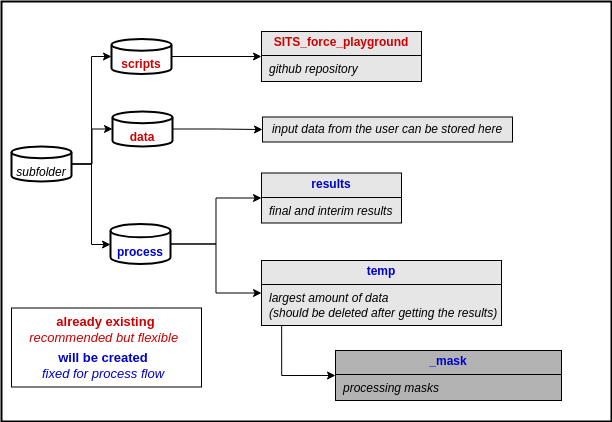

# SITS Force Playground

Code for playing around with [FORCE Time Series Framework](https://force-eo.readthedocs.io/en/latest/index.html). 
The code works with the latest FORCE _**3.9.02-dev:::2025-10-16**_.


## 1. Installing
These basic parameters installations are implemented for Ubuntu. 
To set up the environment, please follow the steps below:
```
conda create --name SITSclass python==3.9
conda activate SITSclass
cd /path/to/your/folder/SITS_force_playground
pip install -r requirements.txt
sudo apt-get install xterm
```

_**Notes:**_ Code is build upon FORCE Framework version 3.9.02. Please make sure to have this version installed. 
You can either install FORCE directly on your system or use the Docker container.

* [How to Install FORCE with Docker](https://force-eo.readthedocs.io/en/latest/setup/docker.html#docker)


## 2. Getting Started

The script is based on the following folder structure:



The script should help to use FORCE-Framework path handling. The functions are explained below:
- _**create_folder_structure**_: Checking / creating the folder structure.
- _**force_class**_: Creates a simple parameter file with some basic information filled.
- _**force_class_udf**_: Creates a parameter file to use your User defined function formula/script to obtain your own index.
- _**execute_cmd**_: Executes the parameter file given by path.

_**Note:**_ As a thumb rule, always double-check your parameter files before executing them. 
There are many parameters that need to be set according to your data and needs.
## Versioning
This repository is based on the latest version of FORCE _**3.9.02-dev:::2025-10-16**_.


## Authors

* [**Benjamin Stöckigt**](https://github.com/Bensouh)
* [**Sebastian Valencia**](https://github.com/Azarozo19)


## License

This project is licensed under the GNU General Public Licence, Version 3 (GPLv3) - see the [LICENSE.md](LICENSE.md) file for details 

## Acknowledgments

* Time Series Classification by [Marc Rußwurm](https://github.com/MarcCoru)


* FORCE Framework by [David Frantz] (https://force-eo.readthedocs.io/en/latest/index.html).